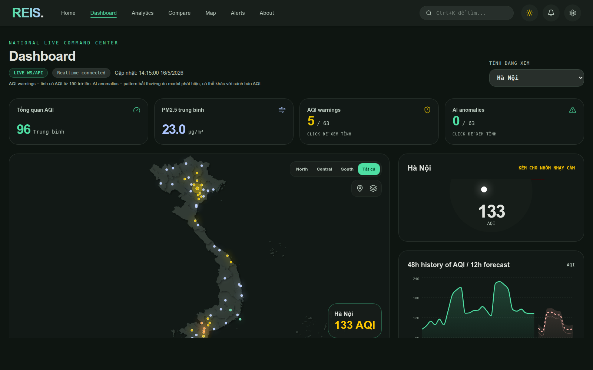
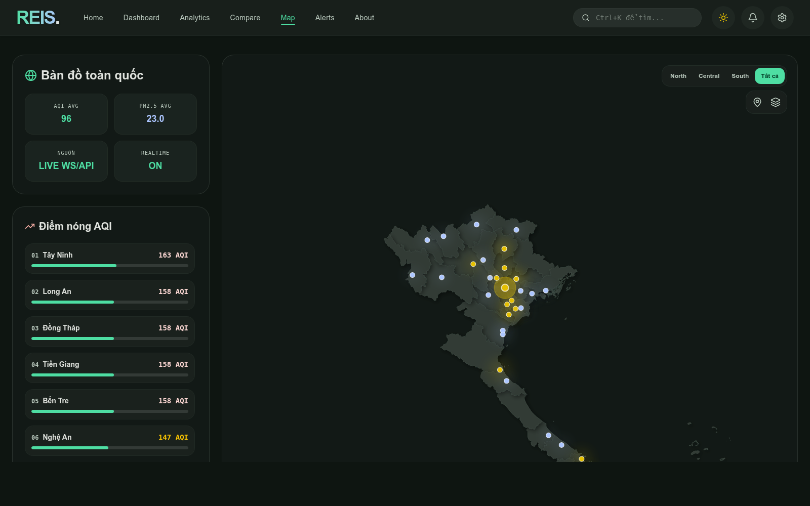
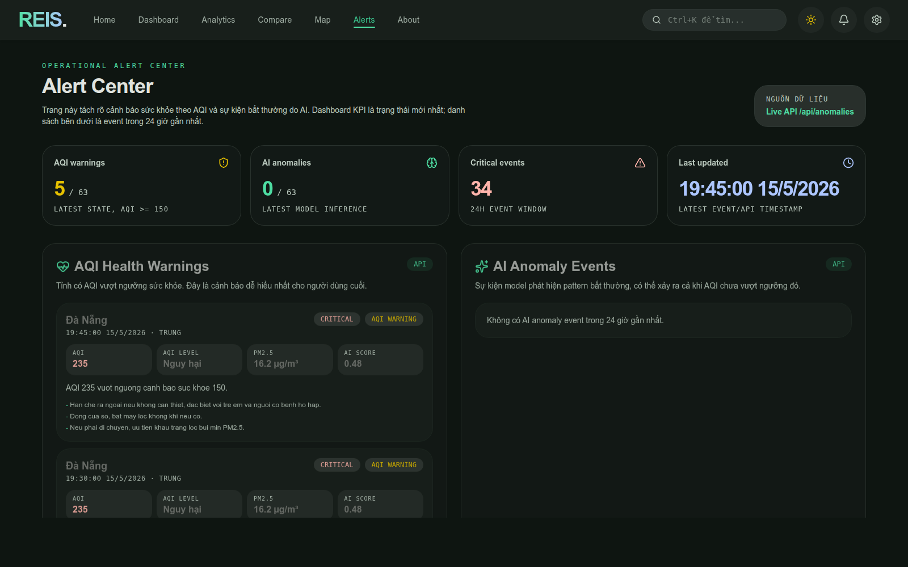
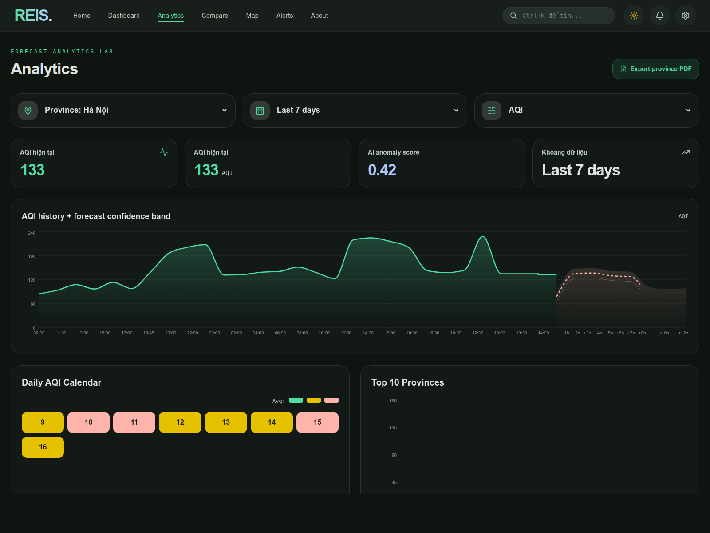
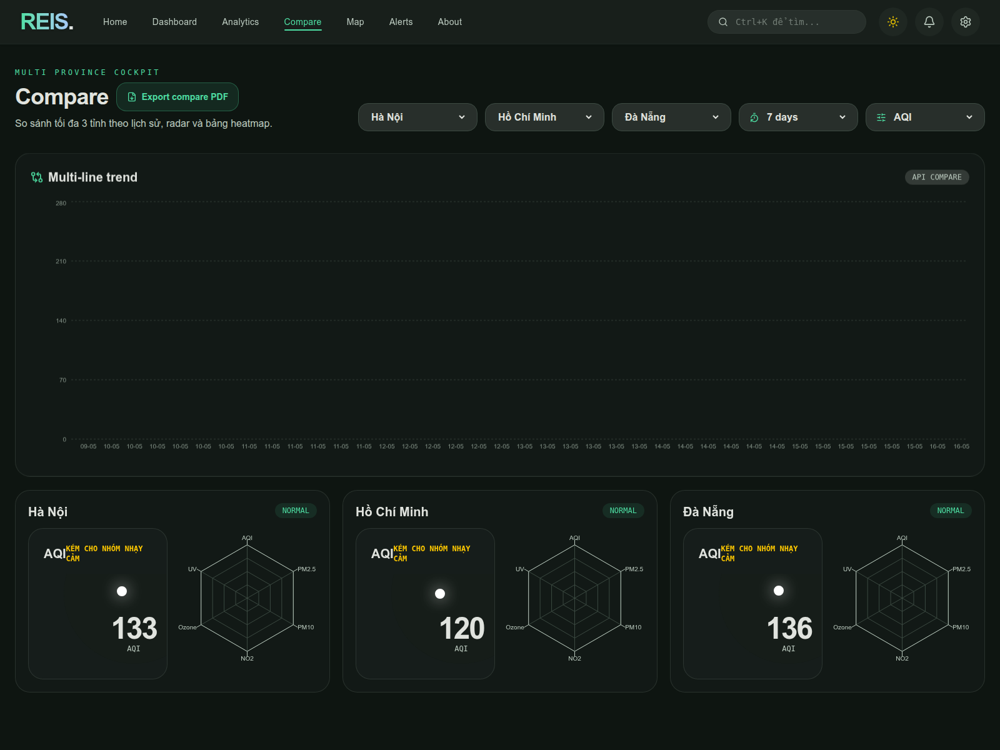

# REIS — Realtime Environmental Intelligence System

> Hệ thống giám sát môi trường theo thời gian gần thực cho 63 tỉnh/thành Việt Nam: thu thập dữ liệu, stream qua Kafka, lưu TimescaleDB, phát hiện bất thường, dự báo ngắn hạn, sinh insight và hiển thị trên dashboard frontend.

[](https://python.org)
[](https://fastapi.tiangolo.com)
[](https://react.dev)
[](https://vitejs.dev)
[](https://kafka.apache.org)
[](https://www.timescale.com)

---

## Giao Diện Hệ Thống

REIS có frontend dạng command center: bản đồ AQI toàn quốc, KPI realtime, forecast, insight, cảnh báo và báo cáo PDF. Các ảnh dưới đây là ảnh chụp thật từ app local đang chạy với API/DB.



| Bản đồ toàn quốc | Alert Center |
|---|---|
|  |  |

| Analytics | Compare |
|---|---|
|  |  |

---

## Mục Lục

- [1. REIS giải quyết vấn đề gì?](#1-reis-giải-quyết-vấn-đề-gì)
- [2. Tính năng chính](#2-tính-năng-chính)
- [3. Frontend có những trang nào?](#3-frontend-có-những-trang-nào)
- [4. Kiến trúc hệ thống](#4-kiến-trúc-hệ-thống)
- [5. Cách chạy project](#5-cách-chạy-project)
- [6. API chính](#6-api-chính)
- [7. PDF report](#7-pdf-report)
- [8. Insight & Interpretation](#8-insight--interpretation)
- [9. Test và kiểm tra](#9-test-và-kiểm-tra)
- [10. Ghi chú vận hành](#10-ghi-chú-vận-hành)

---

## 1. REIS Giải Quyết Vấn Đề Gì?

Các dashboard AQI thông thường thường chỉ trả lời câu hỏi:

```text
Hiện tại AQI là bao nhiêu?
```

REIS đi xa hơn một bước. Hệ thống cố gắng trả lời:

- Tỉnh nào đang có chất lượng không khí xấu?
- Chỉ số hiện tại có bất thường so với pattern dữ liệu không?
- 12 giờ tới AQI có xu hướng tăng hay giảm?
- Dữ liệu có insight gì đáng chú ý?
- Người dùng nên hành động như thế nào?
- Có thể xuất báo cáo PDF để nộp/thuyết trình/chia sẻ không?

Luồng tư duy chính:

```text
Observe -> Stream -> Store -> Analyze -> Explain -> Act
```

---

## 2. Tính Năng Chính

| Nhóm | Trạng thái | Mô tả |
|---|---:|---|
| Thu thập dữ liệu | Hoàn thành | Lấy dữ liệu weather + air quality từ Open-Meteo cho 63 tỉnh/thành |
| Streaming | Hoàn thành | Producer đẩy dữ liệu vào Kafka, consumer ghi vào TimescaleDB |
| Backfill lịch sử | Hoàn thành | Script backfill mặc định 50 ngày, giúp chart/forecast có đủ dữ liệu |
| Backend API | Hoàn thành | FastAPI REST, WebSocket, Swagger docs |
| Frontend | Hoàn thành | React/Vite với Dashboard, Analytics, Compare, Map, Alerts, About |
| Forecast | Hoàn thành mức demo | Trả forecast 12h với confidence band |
| Anomaly detection | Hoàn thành mức demo | Isolation Forest phát hiện pattern bất thường |
| LLM Insight | Hoàn thành mức demo | Gemini/OpenAI nếu có key, fallback template nếu không có |
| Key Findings | Hoàn thành | Tổng hợp insight từ EDA notebook + live DB |
| PDF report | Hoàn thành | Xuất báo cáo tỉnh, so sánh nhiều tỉnh, báo cáo insight toàn quốc |
| MLOps/Airflow | Skeleton | Có tài liệu/skeleton, chưa phải production pipeline |

---

## 3. Frontend Có Những Trang Nào?

Frontend là phần chính để demo hệ thống. Các trang được thiết kế để người xem hiểu được dữ liệu từ nhiều góc nhìn khác nhau.

| Trang | Route | Vai trò |
|---|---|---|
| Landing | `/` | Giới thiệu sản phẩm và dẫn vào dashboard |
| Dashboard | `/dashboard` | Trung tâm điều hành: KPI, bản đồ, gauge, forecast, insight, Key Findings |
| Analytics | `/analytics` | Phân tích một tỉnh theo khoảng thời gian và metric |
| Compare | `/compare` | So sánh tối đa 3 tỉnh bằng chart, radar card và heatmap table |
| Map | `/map` | Bản đồ toàn quốc với marker AQI theo tỉnh |
| Alerts | `/alerts` | Alert Center: tách rõ AQI warnings và AI anomalies |
| About | `/about` | Giải thích kiến trúc, tech stack và luồng hệ thống |

### Dashboard

Dashboard là màn hình quan trọng nhất khi thuyết trình:

- KPI tổng quan: AQI trung bình, PM2.5 trung bình, số tỉnh cảnh báo, số AI anomaly.
- Bản đồ Việt Nam hiển thị trạng thái tỉnh/thành.
- Panel bên phải hiển thị tỉnh đang chọn: AQI gauge, history + forecast, insight.
- Section `Key Findings` trả lời trực tiếp phần insight/interpretation trong tiêu chí đồ án.
- Nút export `National Insight PDF`.

### Analytics

Trang Analytics dùng khi muốn phân tích sâu một tỉnh:

- Chọn tỉnh.
- Chọn khoảng dữ liệu: 24h, 7 ngày, 30 ngày.
- Chọn metric: AQI, PM2.5, Temperature.
- Hiển thị history + forecast confidence band.
- Có thể export province PDF.

### Compare

Trang Compare dùng để kể câu chuyện so sánh vùng/tỉnh:

- So sánh Hà Nội, TP.HCM, Đà Nẵng hoặc tỉnh tùy chọn.
- Multi-line trend chart.
- Province compare cards.
- Radar profile.
- Heatmap table cho AQI, PM2.5, temperature, wind speed, anomaly score.
- Có thể export compare PDF.

### Alerts

Trang Alerts tách rõ hai loại cảnh báo:

- `AQI Health Warnings`: cảnh báo sức khỏe khi AQI vượt ngưỡng.
- `AI Anomaly Events`: model phát hiện pattern bất thường, có thể xảy ra cả khi AQI chưa quá cao.

Điểm quan trọng: AQI warning và AI anomaly không giống nhau. Một tỉnh có thể AQI cao nhưng không bất thường theo model, hoặc có pattern bất thường dù AQI chưa vượt ngưỡng đỏ.

---

## 4. Kiến Trúc Hệ Thống

```text
Open-Meteo API
    |
    v
collector.py -> validator.py -> producer.py
    |
    v
Kafka topic: env.readings.raw
    |
    v
consumer.py
    |
    v
TimescaleDB env_readings
    |
    v
FastAPI REST + WebSocket + PDF Report
    |
    v
React Frontend
```

### Input -> Process -> Output

| Stage | Input | Process | Output |
|---|---|---|---|
| Ingestion | Open-Meteo weather/AQ data | Fetch async, normalize, validate | Environmental readings |
| Streaming | Valid readings | Publish Kafka, DLQ nếu lỗi | Message stream |
| Processing | Kafka messages | Batch consume, insert DB | TimescaleDB rows |
| ML | Current/history readings | Feature engineering, anomaly, forecast | Score, label, forecast |
| Insight | Reading + anomaly + forecast | Gemini/OpenAI/template + cache | Human-readable insight |
| API | DB + model/cache | FastAPI routes, WebSocket, PDF | JSON, WS payload, PDF |
| Frontend | API/WS data | Chart, map, fallback, state handling | Dashboard demo-ready |

---

## 5. Cách Chạy Project

Các lệnh dưới đây giả định môi trường Python:

```bash
/home/ductien/miniconda3/envs/reis/bin/python
```

Nếu máy khác đường dẫn, thay bằng Python env tương ứng.

### 5.1. Cài dependency

Backend:

```bash
cd /home/ductien/Documents/reis
/home/ductien/miniconda3/envs/reis/bin/python -m pip install -r backend/requirements.txt
```

Frontend:

```bash
cd /home/ductien/Documents/reis/frontend
npm install
```

### 5.2. Bật infra tối thiểu

```bash
cd /home/ductien/Documents/reis
docker-compose up -d zookeeper kafka redis timescaledb
docker-compose ps
```

Kafka UI là optional:

```bash
docker-compose up -d kafka-ui
```

Mở Kafka UI:

```text
http://localhost:8090
```

### 5.3. Setup database

```bash
cd /home/ductien/Documents/reis/backend
/home/ductien/miniconda3/envs/reis/bin/python scripts/setup_db.py
```

Kiểm tra bảng:

```bash
cd /home/ductien/Documents/reis
docker-compose exec timescaledb psql -U reis -d reis_db -c "\dt"
docker-compose exec timescaledb psql -U reis -d reis_db -c "select count(*) from env_readings;"
```

### 5.4. Backfill dữ liệu lịch sử

Nên chạy trước demo để biểu đồ/forecast/insight có đủ dữ liệu:

```bash
cd /home/ductien/Documents/reis/backend
/home/ductien/miniconda3/envs/reis/bin/python scripts/backfill_historical_data.py --days 50
```

### 5.5. Chạy realtime pipeline liên tục

Terminal 1: consumer Kafka -> TimescaleDB

```bash
cd /home/ductien/Documents/reis/backend

KAFKA_BOOTSTRAP_SERVERS=localhost:9092 \
DB_HOST=localhost DB_PORT=5432 DB_USER=reis DB_PASSWORD=reis_secret DB_NAME=reis_db \
/home/ductien/miniconda3/envs/reis/bin/python processing/consumer.py
```

Terminal 2: scheduler producer chạy liên tục mỗi 15 phút

```bash
cd /home/ductien/Documents/reis/backend

KAFKA_BOOTSTRAP_SERVERS=localhost:9092 \
REDIS_HOST=localhost REDIS_PORT=6379 \
/home/ductien/miniconda3/envs/reis/bin/python ingestion/scheduler.py
```

`ingestion/scheduler.py` sẽ chạy một vòng ngay khi start, sau đó lặp lại mỗi 15 phút.

### 5.6. Chạy FastAPI

Terminal 3:

```bash
cd /home/ductien/Documents/reis/backend
/home/ductien/miniconda3/envs/reis/bin/python -m uvicorn api.main:app --host 0.0.0.0 --port 8000 --reload
```

Kiểm tra:

```bash
curl http://localhost:8000/api/health
curl http://localhost:8000/api/summary
curl "http://localhost:8000/api/province/1?hours=168"
```

Swagger:

```text
http://localhost:8000/docs
```

### 5.7. Chạy frontend

Terminal 4:

```bash
cd /home/ductien/Documents/reis/frontend

VITE_API_URL=http://localhost:8000 \
VITE_WS_URL=ws://localhost:8000/ws/live \
npm run dev -- --host 0.0.0.0 --port 3000
```

Mở frontend:

```text
http://localhost:3000
```

---

## 6. API Chính

| Method | Endpoint | Mục đích |
|---|---|---|
| `GET` | `/api/health` | Health check |
| `GET` | `/api/summary` | KPI toàn quốc |
| `GET` | `/api/provinces` | 63 tỉnh + latest reading |
| `GET` | `/api/province/{id}?hours=168` | Detail một tỉnh |
| `GET` | `/api/forecast/{id}` | Forecast 12h |
| `GET` | `/api/insights/{id}` | Insight theo tỉnh |
| `GET` | `/api/insight-summary` | Key Findings từ EDA + live DB |
| `GET` | `/api/anomalies` | Alert Center events |
| `GET` | `/api/compare?province_ids=1,2,4&days=7&metric=aqi` | So sánh nhiều tỉnh |
| `WS` | `/ws/live` | Realtime update cho frontend |

---

## 7. PDF Report

REIS hỗ trợ 3 loại report:

| Report | Endpoint | Dùng ở frontend |
|---|---|---|
| Province report | `/api/report/province/{id}.pdf?hours=168` | Analytics |
| Compare report | `/api/report/compare.pdf?province_ids=1,2,4&days=7&metric=aqi` | Compare |
| National insight report | `/api/report/insights.pdf` | Dashboard Key Findings |

Ví dụ:

```bash
curl -o hanoi-report.pdf "http://localhost:8000/api/report/province/1.pdf?hours=168"
curl -o compare-report.pdf "http://localhost:8000/api/report/compare.pdf?province_ids=1,2,4&days=7&metric=aqi"
curl -o national-insights.pdf "http://localhost:8000/api/report/insights.pdf"
```

PDF được sinh ở backend bằng `reportlab`, có bảng, biểu đồ và phần diễn giải insight.

---

## 8. Insight & Interpretation

Đây là phần quan trọng nhất cho đồ án: hệ thống không chỉ vẽ chart, mà phải giải thích được dữ liệu.

REIS trả lời 4 câu hỏi:

| Câu hỏi | Cách REIS trả lời |
|---|---|
| Xu hướng chính là gì? | AQI có chu kỳ ngày/tuần, thường tăng vào chiều tối |
| Pattern đáng chú ý là gì? | Miền Bắc, đặc biệt Hà Nội và vùng vệ tinh, là cụm ô nhiễm nổi bật |
| Có thể dự đoán/giải thích gì? | AQI có tính nhớ theo thời gian, nên forecast ngắn hạn có cơ sở |
| Insight có giá trị gì? | Giúp người dùng chọn thời điểm ra ngoài, giúp operator ưu tiên cảnh báo vùng |

Nguồn insight gồm:

- EDA notebook làm baseline.
- Live DB bổ sung số liệu hiện tại nếu có.
- LLM/template insight cho từng tỉnh.
- PDF report để xuất kết luận thành tài liệu.

---

## 9. Test Và Kiểm Tra

Backend route tests:

```bash
cd /home/ductien/Documents/reis
/home/ductien/miniconda3/envs/reis/bin/python -m pytest backend/tests/test_api_routes.py -v
```

Consumer + model tests:

```bash
cd /home/ductien/Documents/reis
/home/ductien/miniconda3/envs/reis/bin/python -m pytest backend/tests/test_consumer.py backend/tests/test_isolation_forest.py -v
```

Frontend:

```bash
cd /home/ductien/Documents/reis/frontend
npm run lint
npm run build
```

---

## 10. Ghi Chú Vận Hành

### Source label trên frontend

Frontend luôn gắn nhãn nguồn dữ liệu:

- `LIVE API`: REST API đang hoạt động.
- `LIVE WS/API`: WebSocket đang gửi dữ liệu realtime.
- `MOCK FALLBACK`: API chưa sẵn sàng, UI dùng fallback deterministic.

Nếu thấy `MOCK FALLBACK`, hãy kiểm tra FastAPI:

```bash
curl http://localhost:8000/api/health
curl http://localhost:8000/api/provinces
```

### Kafka UI unhealthy

Kafka UI chỉ là tool phụ. Nếu Kafka healthy thì pipeline vẫn chạy được.

Nếu Kafka bị kẹt session Zookeeper, chạy:

```bash
cd /home/ductien/Documents/reis
docker-compose up -d zookeeper
sleep 20
docker-compose up -d kafka kafka-ui redis timescaledb
docker-compose ps
```

### AI score là `N/A`

Thường do một trong các lý do:

- API đang fallback/mock.
- Model artifacts thiếu hoặc chưa load được.
- FastAPI chưa restart sau khi sửa code.
- Inference lỗi và route fallback về default.

Kiểm tra:

```bash
curl "http://localhost:8000/api/province/1?hours=48"
```

Tìm field:

```json
"inference_source": "model | cache"
```

### Giới hạn hiện tại

Project đã demo-ready nhưng chưa phải production:

- Chưa có authentication.
- Chưa có monitoring production.
- Alert Telegram/email mới là hướng phát triển.
- Airflow/MLOps mới ở mức skeleton/docs.
- Forecast confidence band vẫn là mức demo, chưa calibrated như production.

---

## Kết Luận

REIS không chỉ là dashboard AQI. Hệ thống mô phỏng một vòng lặp dữ liệu hoàn chỉnh:

```text
Thu thập -> Stream -> Lưu trữ -> Phân tích -> Dự báo -> Giải thích -> Báo cáo
```

Điểm mạnh nhất của project nằm ở việc kết hợp **realtime pipeline**, **frontend trực quan**, **AI/ML inference**, và **Insight & Interpretation** để biến dữ liệu môi trường thô thành thông tin có thể hành động.
